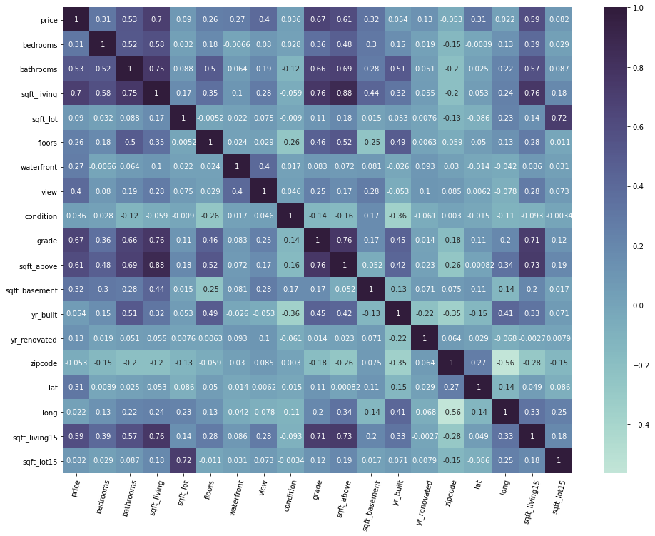
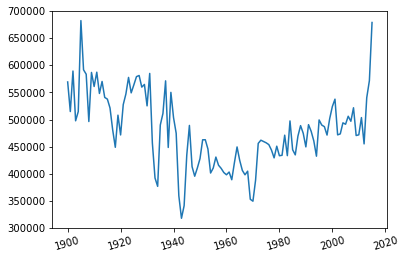
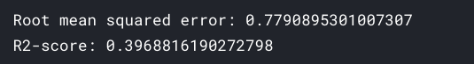
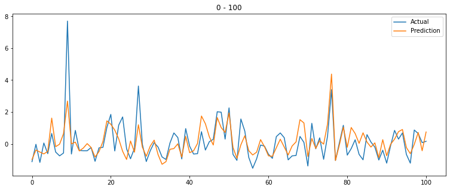

# house-sales-in-king-country-usa

Here [House Sales in King County, USA](https://www.kaggle.com/harlfoxem/housesalesprediction) dataset by [harlfoxem](https://www.kaggle.com/harlfoxem) is used to perform `EDA` on housing prices and creating `machine lerning model` to predict house prices.

**About data source**: This dataset contains house sale prices for King County, which includes Seattle. It includes homes sold between `May 2014 and May 2015`.

## Table of contents

- [Getting started](#getting-started)
- [Findings](#findings)
- [Model performance](#model-performance)
- [License](#license)

## Getting started

The [notebook](https://www.kaggle.com/akashsdas/predict-students-grades) is available on Kaggle to work in the same environment where this notebook was created i.e. use the same version packages used, etc...

## Findings

**Correlation matrix**

**Effects of prices over the years**

To see more go to the [notebook](./notebook.ipynb).

## Model performance

**RMS error and R2 square metrics**

**Actual Vs Predicted values (for 1st 100 samples, to see more go to the [notebook](./notebook.ipynb)**

## License

[APACHE LICENSE, VERSION 2.0](./LICENSE)
